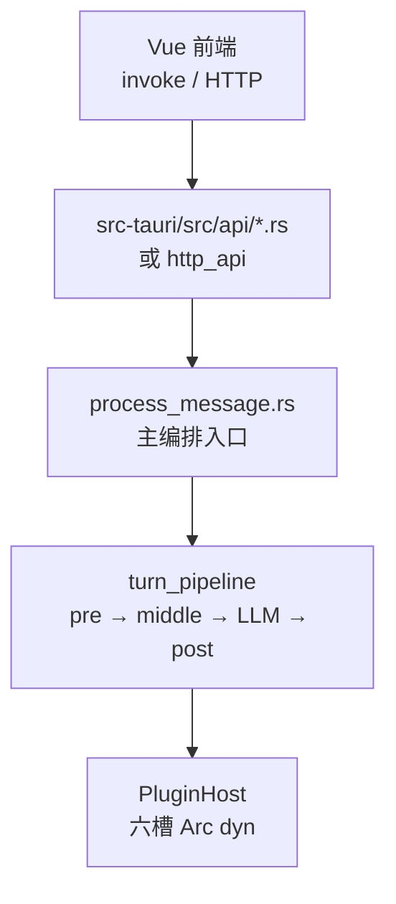
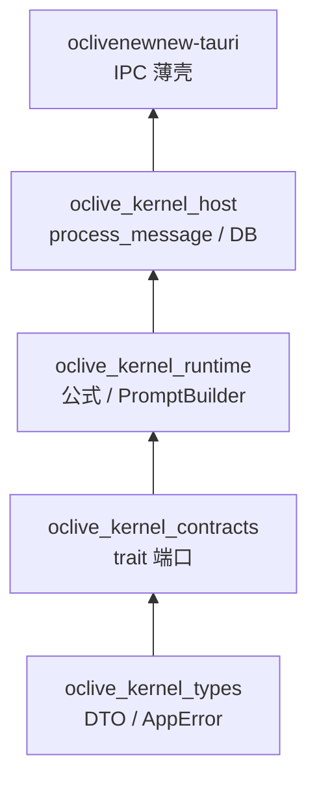

# 01 · 简架构

> **读者**：已跑通主仓、要理解「一条消息怎么走」的工程师。  
> **读完能做什么**：画出 Tauri → `process_message` → 四阶段流水线 → 六槽的主路径。  
> **耗时**：约 30 分钟。  
> **下一篇**：[03 术语表](03_GLOSSARY.md)。

---

## 一轮对话（主路径）

**实现文件**：[`crates/oclive_kernel_host/src/domain/chat_engine/process_message.rs`](../crates/oclive_kernel_host/src/domain/chat_engine/process_message.rs)（经 `chat_engine/mod.rs` re-export）。**不是** `mod.rs` 里的业务逻辑本体。

**概念六段**（文件头注释）：分析情绪 → 检测事件 → 演化性格 → 构建 Prompt → 调用 LLM → 持久化。实际还有 **Agent 短路**、**异地/远程人生** 分支，否则进入 **`co_present`** 共景路径。

---

## turn_pipeline 四阶段

| 阶段 | 模块 | 做什么 |
|------|------|--------|
| **pre** | `turn_pipeline/pre.rs` | 加载上下文、复杂情感、用户身份、建 Prompt 输入 |
| **middle** | `co_present.rs` / `remote_life.rs` | 共景中间态（好感、关系等） |
| **LLM** | `turn_pipeline/post.rs` | 调用 `pl.llm` |
| **post** | `turn_pipeline/post.rs` | 持久化、聊天存储、立绘状态（**v0.4+ 草案**：第 3/4 设施 post_llm）、回填 `reply` |

入口：[`turn_pipeline/mod.rs`](../crates/oclive_kernel_host/src/domain/chat_engine/turn_pipeline/mod.rs) 的 `execute_turn`。

---

## 六槽与 PluginHost

| 槽 | trait / 实现入口 |
|----|------------------|
| `memory` | `MemoryRetrieval` |
| `emotion` | `UserEmotionAnalyzer` |
| `event` | `EventEstimator` |
| `prompt` | `PromptAssembler` |
| `llm` | `LlmClient` |
| `agent` | `AgentProvider` |

- **解析**：`PluginHost::resolve_for_role` → [`plugin_host/`](../crates/oclive_kernel_host/src/domain/plugin_host/mod.rs)
- **多实例**：蓝图 `slot_registry` → [`slot_resolver.rs`](../crates/oclive_kernel_host/src/domain/slot_resolver.rs)
- **后端实现表**：[`backend_registry.rs`](../crates/oclive_kernel_host/src/infrastructure/backend_registry.rs)

v2 **不以**蓝图 `steps[]` 调度首轮；顺序由 **Rust 编排** 审计。

---

## Crate 五层（依赖方向）

口诀：**Types = 形状，Contracts = 接口，Runtime = 公式，Host = 流程，Tauri = 入口。**

速查：[crates/README.md](../crates/README.md)

---

## 验收

- [ ] 能指出 `process_message.rs` 是实现文件
- [ ] 能说出六槽名称与 `PluginHost` 职责
- [ ] 知道主编排不读蓝图 `steps[]` 作 DSL

---

## 深度链接

- [OCLIVE_ARCHITECTURE_OVERVIEW](../creator-docs/getting-started/OCLIVE_ARCHITECTURE_OVERVIEW.md)
- [BUS_FACTOR_NOTES §1](../handoff/BUS_FACTOR_NOTES.md#1-内核编排process_message)
- [DESIGN_DECISIONS](../creator-docs/architecture/DESIGN_DECISIONS.md)
