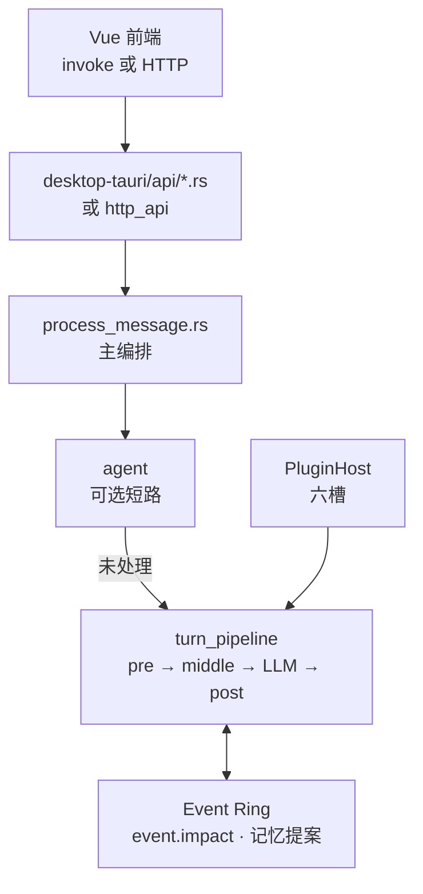
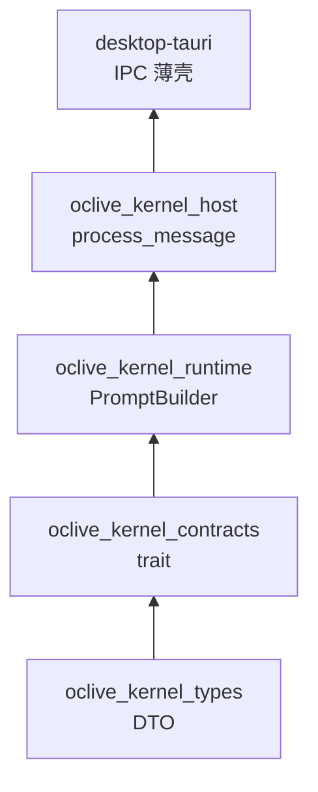

# 01 · 简架构

> **最后更新**：2026-09-01
> **读者**：已跑通主仓、要理解「一条消息怎么走」的工程师。  
> **读完能做什么**：画出用户回合与主动回合主路径；说清六槽、Event Ring、上下文来源和四层权力边界。
> **耗时**：约 **45 分钟**（含下面扩展节）。  
> **下一篇**：[03 术语表](03_GLOSSARY.md) · 逐槽细节 → [MODULE_MAP §4–§12](../handoff/MODULE_MAP_AND_HANDOFF.md)。

配套学习图：[OCLive 架构学习长图（SVG，可无限放大）](assets/oclive-architecture-learning-map.svg) · [PNG](assets/oclive-architecture-learning-map.png)。图是学习摘要，模块定义仍以 MODULE_MAP 与源码为准。

---

## 一轮对话（主路径）


```mermaid
flowchart TB
  UI[Vue 前端\ninvoke 或 HTTP]
  API[desktop-tauri/api/*.rs\n或 http_api]
  PM[process_message.rs\n主编排]
  AG[agent\n可选短路]
  TP[turn_pipeline\npre → middle → LLM → post]
  ER[Event Ring\nevent.impact · 记忆提案]
  PH[PluginHost\n六槽]
  UI --> API --> PM
  PM --> AG
  AG -->|未处理| TP
  TP <--> ER
  PH --> TP
```

**实现文件**：[`process_message.rs`](../kernel/crates/oclive_kernel_host/src/domain/chat_engine/process_message.rs)（经 `chat_engine/mod.rs` re-export）。

**分支（先知道有这三条）**

| 分支 | 何时 |
|------|------|
| **Agent 短路** | `agent` 槽处理完本回合，可能不再走 LLM 闲聊 |
| **异地 / remote_life** | 用户与角色不在同场景 |
| **共景 co_present** | 默认 Chat Pro 主路径（本文以下默认此路径） |

**概念口诀**：预检 → Agent 短路 → 情绪与记忆 → 事件与思考 → Prompt → LLM → 持久化与展示。顺序由 **Rust 代码**保证；蓝图 **`steps[]` 不参与首轮调度**。

---

## turn_pipeline（共景内）

| 阶段 | 文件 | 做什么 |
|------|------|--------|
| **pre** | `turn_pipeline/pre.rs` | 人格/关系/身份、用户情绪、STM/LTM 检索 |
| **middle** | `turn_pipeline/co_present/run_middle.rs` | Turn Thinking、复杂情感、知识、event 估计、Event Ring、关系预览、Prompt |
| **LLM** | `turn_pipeline/post.rs` + `llm` 槽 | 生成原始 `reply` |
| **post** | `turn_pipeline/post/post_llm.rs` · `persistence.rs` | 角色回复情绪、策略与状态落地、立绘、回复后处理、聊天写入 |

入口：[`turn_pipeline/mod.rs`](../kernel/crates/oclive_kernel_host/src/domain/chat_engine/turn_pipeline/mod.rs) 的 `execute_turn`。

### 上下文从哪里来

| 来源 | 例子 | 谁处理 |
|------|------|--------|
| 当前输入 | 用户消息或外部观察 | `TurnInput` 保持来源边界 |
| 角色包静态内容 | 核心人格、世界观、场景、Prompt 扩展 | loader + prompt 槽 |
| 运行时状态 | 当前人格、关系、好感、情绪、位置、时间 | host 编排/Repository |
| 检索证据 | STM、LTM、近期对话、知识块 | memory/knowledge |
| 本轮派生结果 | 用户情绪、事件影响、复杂情感、激活回想 | emotion/event/设施/Event Ring |

第 4 模块 `prompt` 负责把**已经确定有效**的上下文组装成模型输入；第 5 模块 `llm` 消费它。回复后处理面对的是模型输出，不负责倒推或重做上下文决策。

### 谁能决定什么

| 组件 | 一句话权力 |
|------|------------|
| Rust 编排 | 决定阶段、分支、结果何时应用和持久化 |
| Event Ring | 签发事件身份、来源、注册权重、顺序和因果链 |
| Event 决策模块 | 决定自己负责的一类提案是否采纳 |
| 六槽/设施 | 提供检索、分析、估计、组装或生成能力 |
| 后处理 | 修改最终展示文本，不重做事件与记忆决策 |

口诀：**六槽提供能力，Ring 管事件可信流通，决策模块管采纳，Rust 编排管最终应用。**

### Turn Thinking（Fast / Deep · 编排行）

**不是第七槽**；由 `turn_thinking.rs` + `co_present` 内 `TurnThinkingRouter` 决定本回合档位。

| 层 | 谁配 | 作用 |
|----|------|------|
| **Wave E · 持久化** | 发行版 `distro.oclive.toml` → `[turn_thinking] fast_persistence` | `strong_only` 时 Fast 闲聊不写 LTM / 好感 / 性格演化；**Quarrel 等强事件仍写** |
| **Wave F · 路由** | 角色包 `config.json` → `turn_thinking` | OR/AND 规则、Deep latch（争吵→和解）、`ephemeral_archive` 局面摘要（TTL） |

**纪律**：聊天 turns **每轮仍写** UI 日志；Fast **不压缩**用户原句；**无**玩家 Fast/Deep 开关。人类开工包 → [modules/orchestration/turn-thinking.md](modules/orchestration/turn-thinking.md) · 深读：[RFC_TURN_THINKING_PERSISTENCE](../creator-docs/rfc/RFC_TURN_THINKING_PERSISTENCE.md) · [MODULE_MAP §12](../handoff/MODULE_MAP_AND_HANDOFF.md)。

---

## 记忆：三套存储（最易混 · 必背）

很多人说的「记忆有三层」，在本项目里指 **三套 SQLite/存储职责**，**不是** Prompt 的「系统/角色/用户」三层。

| 存储 | 表 / 组件 | 干什么 | 会进 Prompt 吗 |
|------|-----------|--------|----------------|
| **① 聊天日志** | `chat_sessions` / `chat_messages`（HybridConversationStore） | UI 聊天记录、导出、**记忆回放**数据源 | **否** |
| **② 短期记忆 STM** | `short_term_memory` | 近几轮缓冲 | **是**（memory 槽检索） |
| **③ 长期记忆 LTM** | `long_term_memory` | AI 归档、mention 衰减 | **是**（memory 槽检索） |

**三条纪律**

1. **删聊天记录 ≠ 清空 AI 记忆表**  
2. **MemoryEngine 不读** `{app_data}/chats/` 当真源  
3. 「记忆回放」是从 ① **合并写入** ③，不覆盖已有 LTM 全文  

深读：[CHAT_STORAGE_ARCHITECTURE](../handoff/CHAT_STORAGE_ARCHITECTURE.md) · 模块注册表：[MODULE_MAP §4](../handoff/MODULE_MAP_AND_HANDOFF.md#4-第-1-模块--memory)

---

## 六槽（第 1–6 后端模块）

| # | 键 | 职责（人话） |
|---|-----|--------------|
| 1 | `memory` | 检索 ②③ 注入 Prompt |
| 2 | `emotion` | 分析用户句情绪 |
| 3 | `event` | legacy 对话事件类型/影响估计；结果进入 Event Ring |
| 4 | `prompt` | 组装完整 prompt 字符串 |
| 5 | `llm` | 调用模型生成 **reply** |
| 6 | `agent` | 工具 / MCP；可短路主链 |

- **解析链**：蓝图 `slot_registry` → `PluginHost::resolve_for_role`  
- **多实例**：同 type 折叠为运行时 `PluginBackends`（memory 去重合并 · llm last-wins）  
- **backend 真值表**（24 格）：[`SLOT_BACKEND_REALITY_MATRIX`](../handoff/SLOT_BACKEND_REALITY_MATRIX.md)  

**逐槽定义、trait、禁止项** → [MODULE_MAP §4–§9](../handoff/MODULE_MAP_AND_HANDOFF.md)。

---

## Event Ring：外环，不是第七槽

Event Ring 不按固定顺序强制所有模块运行。模块先注册自己订阅/允许发射的事件；可信宿主另行分配基础影响权重和失败策略。模块只能提交草案，Ring 负责签发真实来源、权重、顺序和因果链。

当前两条最重要的链：

```text
event 槽估计 → chat.event_impact.estimated → Ring → 人格/关系预览

memory 找到候选 → recall.candidate → event decision
  → recollection.activated（可能没有）→ 本轮回想 Prompt
```

权重只表示提案被判断时的基础影响力，不代表执行优先级，也不保证被采纳。完整契约见 [EVENT_RING](../creator-docs/plugin-and-architecture/EVENT_RING.md)。

> **不要把当前 Ring 画成永久事件河流**：这里的“外环”是单次 dispatch 路由边界，不是持续轮询模块的运行顺序。跨回合/跨通道/跨重启的 Session Runtime Event Stream、消费游标与回放仍是 [`K-EVENT-STREAM-01` 的未来设计](../creator-docs/rfc/RFC_RUNTIME_EVENT_STREAM.md)；即使以后实现，也不能替代 Event 决策、Rust 状态提交权或 Stable 回合管线。

### 没有用户消息时如何主动开口

```text
可信传感器/系统适配器提出事件
  → proactive_turn_decision
  → 权威授权事件
  → 一次性 Permit
  → process_proactive_turn
  → 以 ExternalObservation 进入共景回复管线
```

外部观察不会冒充用户消息；当前也不写用户聊天、STM/LTM、关系或人格。它仍缺去重、冷却、频率限制、用户输入抢占和通用输出端口，因此是可用地基，不是无限自动运行的 Bot。

---

## 不是六槽，但常一起问

| 类别 | 例子 | 占 `plugin_backends` 吗 |
|------|------|-------------------------|
| **第 N 设施子模块** | 复杂情感 hint、专家路由、立绘、视觉舞台 | **否**（编排行内） |
| **独立通道** | 用户身份、回复后处理、剧场 Scene Director API | **否** |
| **编排行策略** | Turn Thinking、发行版 `HostProfile` | **否** |

一张总表：[MODULE_MAP §2](../handoff/MODULE_MAP_AND_HANDOFF.md#2-模块四大类划分)。

---

## 配置谁说了算（四层）

```text
角色包内容（人设、场景）
  → 蓝图 slot_registry（六槽、引擎策略）
    → 发行版 distro.oclive.toml（HostProfile）
      → 会话 DB 覆盖（临时）
```

创作者 **只改** 角色包；**不要** 在「改 mumu 文案」任务里动 `slot_registry`。见 [ROLE_PACK_BOUNDARY](../handoff/ROLE_PACK_BOUNDARY.md)。

---

## Crate 五层（依赖方向）


```mermaid
flowchart BT
  types[oclive_kernel_types\nDTO]
  contracts[oclive_kernel_contracts\ntrait]
  runtime[oclive_kernel_runtime\nPromptBuilder]
  host[oclive_kernel_host\nprocess_message]
  tauri[desktop-tauri\nIPC 薄壳]
  types --> contracts --> runtime --> host --> tauri
```

口诀：**Types 形状 · Contracts 接口 · Runtime 公式 · Host 流程 · Tauri 入口。**

---

## 验收

- [ ] 能指出 `process_message.rs` 与 `co_present` 的关系  
- [ ] 能区分 **聊天日志 / STM / LTM** 三者  
- [ ] 能列出六槽名称，并说出「复杂情感 **不是** 第七槽」  
- [ ] 能区分 legacy `event` 槽、Event Ring、Event 决策模块和 Rust 编排
- [ ] 能说出用户消息与 `ExternalObservation` 为什么必须分开
- [ ] 知道主编排 **不读** 蓝图 `steps[]` 当 DSL  

---

## 深度链接

- [MODULE_MAP_AND_HANDOFF](../handoff/MODULE_MAP_AND_HANDOFF.md) — **模块注册表**  
- [RFC_TURN_THINKING_PERSISTENCE](../creator-docs/rfc/RFC_TURN_THINKING_PERSISTENCE.md) — Fast/Deep · 持久化 · 包级路由  
- [OCLIVE_ARCHITECTURE_OVERVIEW](../creator-docs/getting-started/OCLIVE_ARCHITECTURE_OVERVIEW.md) — 对外叙述  
- [BUS_FACTOR_NOTES §1](../handoff/BUS_FACTOR_NOTES.md#1-内核编排process_message)
