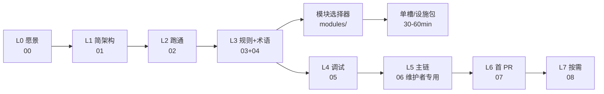

# 人类开发者接手包

> **读者**：不用 Cursor 的 Rust / Vue 工程师，要在 3–5 个工作日内完成「clone → 跑通主仓 → 读懂主链 → 第一个内核 PR」。  
> **耗时**：按学习阶梯 L0–L6 约 **2–3 天**（有维护者带教可压到 **1–2 天**）。  
> **排版原则**：人类认知负担有限——本包 **可以更长、更细、更好读**；契约百科在 [`creator-docs/`](../creator-docs/) 与 [`handoff/`](../handoff/)，**AI 精简索引**见 [`AGENTS.md`](../AGENTS.md) 与 [`ai-package/README.md`](ai-package/README.md)。

**下一篇**：从 [00 愿景与定位](00_VISION_AND_POSITIONING.md) 开始，或已会 Rust 则直接 [02 三十分钟跑通](02_THIRTY_MINUTE_START.md)。

---

## 文档包进度（与 AI 包同步 · 2026-07-10）

**维护纪律**：改架构/纪律时 **须同轮** 更新本表与 [`handoff/README.md`](../handoff/README.md) §文档分责；已有英文镜像的中文页变更时，**同轮**更新 `human-docs-en/` / `creator-docs-en/` 对应文件。台账见 [creator-docs-en/README § Coverage matrix](../creator-docs-en/README.md#mirror-coverage-matrix) · [human-docs-en/README § Mirror status](../human-docs-en/README.md#mirror-status-human-docs-en)。

| 区块 | 状态 | 说明 |
|------|------|------|
| **L0–L2 入门阶梯** | **Done** | 00–02 可读；英文 L0–L2 在 [`human-docs-en/`](../human-docs-en/) |
| **L3 术语 + L4 工程约束** | **Done** | 03/04；04 已含 **§8 文档贡献（人类版）** |
| **L5 内核路径** | **Done** | 06；已链 MODULE_MAP · 记忆三套存储 |
| **L6–L8 任务 / 地图 / PR** | **Done** | 07–10；08 资料地图含文档分责 |
| **01 简架构** | **Done（2026-06-26）** | 模块四类 · 记忆三套 · **Turn Thinking**（Wave E/F 导读） |
| **Turn Thinking 文档** | **Done** | RFC [`RFC_TURN_THINKING_PERSISTENCE`](../creator-docs/rfc/RFC_TURN_THINKING_PERSISTENCE.md) · 英文摘要 [`creator-docs-en/rfc/`](../creator-docs-en/rfc/RFC_TURN_THINKING_PERSISTENCE_SUMMARY.md) · ROLE_PACK §9.11 |
| **team/ 垂直 sprint** | **Done** | 视觉/语音边界 · 组员不必读全仓 |
| **模块注册表（深读）** | **handoff** | [`MODULE_MAP_AND_HANDOFF.md`](../handoff/MODULE_MAP_AND_HANDOFF.md) — 人类 L5+ 深读，不在 human-docs 复制 |
| **AI 文档纪律 G10–G16** | **Done** | AI 详述 → [`AI_CHANGE_BOUNDARIES`](../handoff/AI_CHANGE_BOUNDARIES.md)；人类摘要 → [04 §8](04_ENGINEERING_RULES.md#8-文档贡献纪律人类版) |
| **模块开工包（H-DOC-04）** | **Done** | [`modules/README.md`](modules/README.md) · 全类 Done 2026-06-26 |
| **human-docs-en 镜像** | **Done** | L0–L8 主干 · `modules/` 19/19 · `paths/` 三路径 · `team/` 仍中文（intentional） |
| **creator-docs-en 镜像** | **Done** | ≥95% 契约/kernel/role-pack/testing/dual-core 已镜像；`video-script/` index-only · **`check-doc-mirror.mjs`** 门禁 |

**待办（文档债 · 非代码债）**

| ID | 项 | 优先级 |
|----|-----|--------|
| H-DOC-01 | `human-docs-en/06_KERNEL_LEARNING_PATH` 英文摘要 | **Done**（2026-06-26） |
| H-DOC-02 | 人类文档文首「最后更新」徽标 | **Done**（2026-06-26 · 01/04/06 + EN 镜像） |
| H-DOC-03 | 物理迁移 `04_4.6` / `CHAT_STORAGE_MIRROR_COLLAPSE` → `archive/` | P3 · 需批量改链 |
| H-DOC-04 | 人类模块化开工包 `human-docs/modules/` | **Done**（2026-06-26） |

---

## 人类 vs AI 文档分工

| | **人类包**（本目录） | **AI 包**（`AGENTS` + `handoff` + `creator-docs`） |
|--|---------------------|-----------------------------------------------------|
| **目标** | 顺序阅读 · 时间盒 · 验收清单 | 精简索引 · SSOT · 门禁 |
| **篇幅** | 可长可细 · 表格/图/分段 | 短 · 链出 · 禁止复制长表 |
| **进度** | 本页 **文档包进度** | [`TECHNICAL_DEBT_INVENTORY`](../handoff/TECHNICAL_DEBT_INVENTORY.md) §1 |
| **改文档** | 先读 [04 §8](04_ENGINEERING_RULES.md#8-文档贡献纪律人类版) | G10–G16 · [`AI_CHANGE_BOUNDARIES`](../handoff/AI_CHANGE_BOUNDARIES.md) |
| **五层分工** | 人类阶梯 vs 契约 vs handoff | [`handoff/README`](../handoff/README.md) §文档分层 |

---

## 学习阶梯

| 层级 | 文档 | 核心问题 | 约耗时 |
|------|------|----------|--------|
| **L0** | [00 愿景与定位](00_VISION_AND_POSITIONING.md) | 这是什么、不是什么 | 15 min |
| **L1** | [01 简架构](01_ARCHITECTURE_SIMPLE.md) | 一轮对话怎么流 · **记忆三套** · 六槽 | 45 min |
| **L2** | [02 三十分钟跑通](02_THIRTY_MINUTE_START.md) | 主仓怎么跑、怎么验 | 30 min |
| **L3** | [03 术语表](03_GLOSSARY.md) + [04 工程约束](04_ENGINEERING_RULES.md) | 缩写 · PR 规则 · **写文档纪律** | 45 min |
| **L4** | [05 调试](05_DEBUGGING.md) | 不用 AI 怎么查问题 | 30 min |
| **L5** | [06 内核学习路径](06_KERNEL_LEARNING_PATH.md) | **内核主链维护者专用** Day 1–5 | 半天–3 天 |
| **L6** | [07 常见任务](07_COMMON_TASKS.md) | 改 X 从哪下手 | 按需 |
| **L7** | [08 资料地图](08_REFERENCE_MAP.md) | 深文档去哪找 | 按需 |
| **L8** | [08 PR 门禁](08_PR_GATE_MATRIX.md) · [09 术语速查](09_GLOSSARY.md) · [10 Windows](10_SETUP_WINDOWS.md) | CI 对照 · 缩写 · MSVC | 按需 |

英文镜像（L0–L8 主干 + modules 摘要）：[`human-docs-en/README.md`](../human-docs-en/README.md) · 覆盖台账见该页 [Mirror status](../human-docs-en/README.md#mirror-status-human-docs-en)

**刻意延后到 L7**：`dual_core`、Monolith、蓝图 v3、handoff 归档细节、姊妹仓实现。

---

## 模块选择器（L3 后默认分叉）

完成 L0–L3 后，**多数贡献者不必默认读 L5**。按任务选一份开工包（约 30–60 min）：

| 我要改… | 开工包 |
|---------|--------|
| LLM / 目录插件后端 | [modules/slots/llm.md](modules/slots/llm.md) |
| Agent / MCP 工具 | [modules/slots/agent.md](modules/slots/agent.md) |
| 记忆检索 / STM·LTM | [modules/slots/memory.md](modules/slots/memory.md) |
| 角色包文案 / 人设文件 | [modules/packs/role-pack-content.md](modules/packs/role-pack-content.md) |
| `config.json` / turn_thinking | [modules/packs/role-pack-config.md](modules/packs/role-pack-config.md) |
| Vue / invoke 前端 | [modules/surfaces/frontend-chat-pro.md](modules/surfaces/frontend-chat-pro.md) |
| **全表** | [modules/README.md](modules/README.md) |

---

## 按角色分流

| 你是谁 | 建议路径 |
|--------|----------|
| **内核贡献者** | L0 → L2 → L3 → **L5** → L6；深读 [MODULE_MAP](../handoff/MODULE_MAP_AND_HANDOFF.md) · [BUS_FACTOR](../handoff/BUS_FACTOR_NOTES.md) |
| **前端贡献者** | L2 → [paths/frontend.md](paths/frontend.md) → [modules/surfaces/](modules/surfaces/) |
| **插件作者** | L0–L3 → [paths/plugin-author.md](paths/plugin-author.md) → [modules/slots/](modules/slots/) |
| **集成方** | L2 → [paths/integrator.md](paths/integrator.md) → [modules/surfaces/distro-hostprofile.md](modules/surfaces/distro-hostprofile.md) |
| **Chat Pro 垂直 sprint** | [team/README.md](team/README.md) → [SCOPE_AND_BOUNDARIES](team/SCOPE_AND_BOUNDARIES.md) |

---

## 验收（自学完成标准）

- [ ] 仅读 [02](02_THIRTY_MINUTE_START.md) 能 `npm run tauri:dev` 并完成 `npm run check`
- [ ] 在 [03](03_GLOSSARY.md) 找到 `srid`；在 [01](01_ARCHITECTURE_SIMPLE.md) 说清 **聊天日志 vs 短期 vs 长期记忆**
- [ ] [06](06_KERNEL_LEARNING_PATH.md) 能指引到 `process_message.rs`
- [ ] [04](04_ENGINEERING_RULES.md) 覆盖 Prompt / guardrails / import / **文档 SSOT 一条**

---

## 深度链接（SSOT）

| 主题 | 文档 |
|------|------|
| **模块注册表（逐槽）** | [MODULE_MAP_AND_HANDOFF](../handoff/MODULE_MAP_AND_HANDOFF.md) |
| 架构总述 | [OCLIVE_ARCHITECTURE_OVERVIEW](../creator-docs/getting-started/OCLIVE_ARCHITECTURE_OVERVIEW.md) |
| 文档分责 · 耦合审计 | [handoff/README §文档分责](../handoff/README.md) |
| 贡献与测试 | [CONTRIBUTING](../CONTRIBUTING.md) |
| AI 接手包说明 | [ai-package/README.md](ai-package/README.md) |

*最后更新：2026-06-26 · H-DOC-04 模块开工包 Done。*
