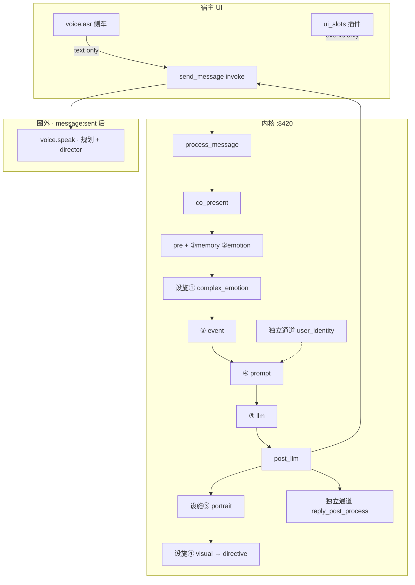

# 架构解耦全景 · 模块 / 插件 / 正交轴

> **读者**：要把「六槽、设施、独立通道、目录插件、正交轴」一次看清的工程师或产品讨论参与者。  
> **先读**：**§1 核心术语**（六槽 · 独立通道 · 正交 的含义与边界）。  
> **SSOT 分工**：**模块定义与关系** → [`handoff/MODULE_MAP_AND_HANDOFF.md`](../../handoff/MODULE_MAP_AND_HANDOFF.md)；**六槽 DTO 与顺序** → [`PLUGIN_V1.md`](../../creator-docs/plugin-and-architecture/PLUGIN_V1.md)；**本文** = **脉络展开 + 插件清单 + 正交轴索引**（不替代 MODULE_MAP 定义条文）。  
> **最后更新**：2026-07-05

---

## 0. 一张总图

```text
                         用户 / 创作者配置
                    （角色包 · 蓝图 · 发行版 · 会话）
                                    │
        ┌───────────────────────────┼───────────────────────────┐
        │                           │                           │
        ▼                           ▼                           ▼
   ① 六槽后端模块            ② 设施子模块              ③ 独立通道能力增强
   memory…agent              复杂情感…视觉表现          user_identity…voice.asr
   plugin_backends            turn_pipeline 内           自有 resolve / 圈外 API
   / slot_registry             无六槽键                   无六槽键 · 无设施号
        │                           │                           │
        └───────────────────────────┼───────────────────────────┘
                                    ▼
                    process_message → co_present → … → post_llm
                                    │
        ┌───────────────────────────┼───────────────────────────┐
        │                           │                           │
        ▼                           ▼                           ▼
   ④ 目录插件实现            编排行策略（§10）            宿主正交轴
   provides / ui_slots         Turn Thinking 等            shell / theme / skin
   子进程 RPC                   非模块号                     不改六槽逻辑
```

**集成三层**（语音线常用）：UI / 侧车插件 → Tauri invoke / HTTP `:8420` → 内核编排。见 [SCOPE_AND_BOUNDARIES.md §集成三层](./SCOPE_AND_BOUNDARIES.md)。

**核心术语精确定义** → 本文 **§1**（六槽 · 独立通道 · 正交）。

---

## 1. 核心术语：六槽 · 独立通道 · 正交

> 下文是讨论架构时的 **含义 SSOT**；槽位 trait / DTO 细节仍链 [`PLUGIN_V1.md`](../../creator-docs/plugin-and-architecture/PLUGIN_V1.md) · [`MODULE_MAP`](../../handoff/MODULE_MAP_AND_HANDOFF.md)。

### 1.1 六槽（第 1–6 后端模块）

**是什么**

- 宿主 **`PluginBackends`** 上的 **六个固定键**：`memory` · `emotion` · `event` · `prompt` · `llm` · `agent`。
- v2 角色包通过 **`slot_registry`** 声明多实例，折叠成上述六键后，由 **`PluginHost::resolve_for_role`** 绑定到各槽 **trait** 实现（builtin / ollama / remote / directory 等）。
- 每一轮 **`send_message`** 的主路径：`process_message` → **`co_present`** → pre → event → build prompt → **llm generate** → post_llm；六槽按固定 **stage** 被调用（见本文 §4 表）。

**意味着什么**

| 维度 | 六槽 |
|------|------|
| **职责** | 从用户句到 **`reply` 文本** 的 **编排内** 可替换后端（记、情、事、prompt、生成、agent） |
| **配置** | 蓝图 `slot_registry` · legacy `plugin_backends` · 会话 override |
| **编号** | 第 **1–6 ** **模块**（与设施 ①–④ **不是同一套编号**） |
| **换实现** | 换 backend / 换 directory 插件，**不改** `process_message` **stage 顺序** |

**不是什么**

- ❌ **不是** UI 上的 `ui_slots`（chat_toolbar 等）— 那是目录插件插槽名，与六键无关。
- ❌ **不是** 设施 ①–④（复杂情感、立绘等）— 设施 **无** `plugin_backends` 键，但在 **同一条** turn_pipeline 里 hook。
- ❌ **不是** 独立通道 — 六槽 **必** 在 Stable 主链调度内（agent 短路是分支，仍属第 6 模块能力）。
- ❌ **不是** 正交轴 — 改 emotion 后端会改变 **pre** 阶段行为，与「只换皮肤」不同。

**代码锚点**：`process_message.rs` · `co_present.rs` · `slot_runner.rs` · `plugin_host.rs`。

---

### 1.2 独立通道能力增强（side-channel capability enhancement）

**规范中英文名**：**独立通道能力增强模块** · RFC alias *orthogonal capability unit*（文档首选中文名 + `side-channel`）。

**是什么**

- 内核扩展能力，**不占**六槽六键，**不占**设施子模块 ①–④ 号。
- 通过 **自有 `resolve_*`** 或 **固定圈外 API / 宿主事件锚点** 接入；可在 manifest 上声明 **`provides: ["<id>"]`**，由 **目录插件** 实现。
- 在 **RFC 注册表 v1** 登记 `id`、锚点、配置落点（见本文 §6 · [RFC_SIDE_CHANNEL §2](../../creator-docs/rfc/RFC_SIDE_CHANNEL_CAPABILITY_ENHANCEMENTS.md)）。

**意味着什么**

| 维度 | 独立通道 |
|------|----------|
| **与主链** | **多数** 对「六槽 stage 顺序」**正交**；少数 **钩在主链上**（见下表「进链？」） |
| **与设施** | **不是**「无编号设施」— 设施在编排行 **内**，独立通道是 **另一条登记维度** |
| **与目录插件** | 插件是 **实现层**；`provides` 命中注册表 `id` 时，插件 **充当** 该通道 backend |
| **扩展规则** | 新 `id` 须 RFC + `resolve_*`，**禁止** 自造第七个 `plugin_backends` 键 |

**进不进 `process_message`？（易混点）**

| `id` | 进主链？ | 锚点 |
|------|----------|------|
| `user_identity` | **是**（pre 多一段 Prompt） | `user_identities/` |
| `reply_post_process` | **是**（post_llm 后改 `reply`） | `config.json` chain |
| `theater_director` | **否** | `POST /theater/scene` |
| `voice.asr` / TTS / director·synth | **否** | 侧车 RPC → 文本或音频；**文本** 仍走既有 `send_message` |

**不是什么**

- ❌ **不是** 六槽第 7 模块（没有、也不计划 silent 加键）。
- ❌ **不是** 编排行策略（Turn Thinking 无注册表 `id`，见 §10）。
- ❌ **不是** 纯 UI 正交轴 — 可以有 **子进程 RPC、模型文件**（如 voice.asr）。

---

### 1.3 正交（orthogonal）

**在 OCLive 里「正交」= 两个维度可独立变化，且 **不强制改写六槽编排结构**。**不是**一个单独的模块类型，也 **≠**「无编号设施」。

**三层含义（勿混）**

| 层次 | 指什么 | 例子 | 文档节 |
|------|--------|------|--------|
| **A · UI 正交轴** | 只改 **宿主壳 / 呈现**；不改 Prompt 公式与 stage 顺序 | `data-shell` · `data-theme` · `data-skin` · 键位 | §11 |
| **B · 对主链正交的能力** | **独立通道 / 侧车**；不进六键、不增 stage | `voice.asr` · TTS profile · `theater` HTTP | §6–§7 |
| **C · 弱耦合用户选项** | 动 **某一槽的 backend 或模型**，但不改槽位表 | 用户选 Ollama 模型 → 仅 **⑤ llm** 行为变 | §11 末行 |

**对照：什么不是「正交」**

| 说法 | 实际归类 | 为何不是正交 |
|------|----------|--------------|
| **设施 ①–④** | 编排行内 · **有编号** | 挂在 pre/post_llm，**在主链里** |
| **§10 编排行策略** | Turn Thinking 等 · **无模块号** | **参与** `co_present` 路由，不是 UI 轴 |
| **PersonalityEngine / 好感** | legacy · 无编号 | 仍在 event 演化路径里 |
| **TTS** | 独立通道 B 类 | 对主链正交，但 **不是** A 类 UI 轴（不进 `data-skin` 表） |

```text
         UI 正交轴 (A)              独立通道 (B)              六槽 + 设施 (主链)
    shell/theme/skin/键位          voice.asr · theater          memory…agent
    换皮肤不改 reply 公式           换 TTS 不改 stage 顺序        换 prompt 后端改 BuildPrompt
              │                            │                            │
              └────────────────────────────┴────────────────────────────┘
                                    均可同时启用
                              （维度独立 ≠ 同一登记表）
```

**语音 profile（ASR / 导演 / 发声器）**：归类 **B** — 用户各选 profile，**不要求**改六槽或设施；设置入口在插件 config，**不是** Win98 皮肤那种 HTML 属性轴（详见 §7 · §11.2）。

---

### 1.4 三术语一句话

| 术语 | 一句话 |
|------|--------|
| **六槽** | 主链里 **六种可替换后端**，键固定为 memory…agent。 |
| **独立通道** | 注册表里的 **圈外/侧车能力**，自有锚点，**不是**第七槽。 |
| **正交** | **换 A 不必改 B 的编排结构**；分 UI 轴、侧车能力、弱耦合选项三层，**≠ 无编号设施**。 |

---

## 2. 解耦形式总表

| # | 解耦形式 | 占六槽？ | 配置落点 | 典型切换方式 | SSOT |
|---|----------|----------|----------|--------------|------|
| **A** | **六槽后端模块**（第 1–6 模块） | **是** | `slot_registry` / legacy `plugin_backends` | 蓝图实例 · backend 枚举 · 会话 override | MODULE_MAP §3–§9 |
| **B** | **设施子模块**（第 1–4 设施） | **否** | 角色 `config.json` · HostProfile · 编排行开关 | skip 标志 · catalog enabled | MODULE_MAP §10 · 各 RFC |
| **C** | **独立通道** | **否** | 角色包目录 · 发行版 `[theater]` · 插件 config | `provides` 解析 · env 覆盖 | MODULE_MAP §11 · [RFC_SIDE_CHANNEL](../../creator-docs/rfc/RFC_SIDE_CHANNEL_CAPABILITY_ENHANCEMENTS.md) |
| **D** | **目录插件**（实现层） | 视 `provides` | `{app_data}/plugins/` · 角色 `ui.json` | 启用/禁用 · slot_order | [DIRECTORY_PLUGINS.md](../../creator-docs/plugin-and-architecture/DIRECTORY_PLUGINS.md) |
| **E** | **编排行策略** | **否** | `distro` HostProfile · 包 `turn_thinking` | Fast/Deep/Auto · concise prompt | MODULE_MAP §12 |
| **F** | **配置四层** | — | 包 → 蓝图 → 发行版 → 会话 DB | 见 §3 | MODULE_MAP §14 · ROLE_PACK_BOUNDARY |
| **G** | **六槽三层解耦** | — | 编译 trait · 配置折叠 · 运行时 override | last-wins / 合并 | MODULE_MAP §3.1 |
| **H** | **宿主 UI 正交轴** | **否** | localStorage / env / `html[data-*]` | 用户设置 · 彩蛋 | MODULE_MAP §13.1–§13.2 |
| **I** | **voice profile 双注册**（规划中） | **否** | 插件 `*_profiles.json` · 角色 `voice_profile.json` | director + synth 各选 profile | [TRACK_VOICE §架构](./TRACK_VOICE_RECOGNITION.md) · 本文 §7 |

---

## 3. 配置四层（谁覆盖谁）

```text
角色包（core_personality · scenes · 可选 voice_profile）
    ↓ 合并
蓝图 pipeline.ocblueprint（slot_registry · runtime_config）
    ↓ 合并
发行版 HostProfile（distro 能力 · turn_thinking · theater.director_plugin）
    ↓ 合并
会话（role_runtime · PluginBackendsOverride · 不写盘）
```

| 层 | 改什么 | 不改什么 |
|----|--------|----------|
| 角色包 | 人设、立绘 catalog、reply 锚点 | `slot_registry`（角色任务边界 G1） |
| 蓝图 | 六槽多实例、directory 插件 id | 内核编排顺序 |
| 发行版 | 默认 agent 关、concise、剧场导演 id | 角色文本 |
| 会话 | 临时 backend override | 磁盘上的包内容 |

---

## 4. 第 1–6 模块 · 六槽（后端模块）

| # | 键 | Trait | 合法 backend | 合并策略 | 主链 stage |
|---|-----|-------|--------------|----------|------------|
| 1 | `memory` | `MemoryRetrieval` | builtin · remote · directory · local · none | 去重合并 | pre 检索 · post 写入 |
| 2 | `emotion` | `UserEmotionAnalyzer` | builtin · remote · directory · none | last-wins | pre |
| 3 | `event` | `EventEstimator` | builtin · remote · directory · none | last-wins | co_present EventEstimate |
| 4 | `prompt` | `PromptAssembler` | builtin · remote · directory · none | last-wins | co_present BuildPrompt |
| 5 | `llm` | `LlmClient` | ollama · remote · directory · none | **last-wins** | co_present generate |
| 6 | `agent` | `AgentProvider` | builtin · remote · directory · none | 工具集并集 | 可短路整链 |

**有效 backends 解析链**：`slot_registry` → 用户 LLM 设置 / env → 发行版整表替换 → host_flags → 会话 override → health → `PluginHost::resolve_for_role`。

**backend 24 格真值**：[`SLOT_BACKEND_REALITY_MATRIX.md`](../../handoff/SLOT_BACKEND_REALITY_MATRIX.md)（本文不复制）。

---

## 5. 第 1–4 设施子模块（编排行内）

| # | 名称 | 输入 → 输出 | 锚点 | 默认 | RFC / 代码 |
|---|------|-------------|------|------|------------|
| 1 | **复杂情感** | emotion + 上下文 → `narrative_hint` | pre | on | `complex_emotion.rs` |
| 2 | **专家模型** | 条件 → 专家子流程 | dual_core / routing | **冻结关** | TECHNICAL_DEBT |
| 3 | **立绘** | reply + 上下文 → `visual_state_id` | post_llm | off | [RFC_PORTRAIT](../../creator-docs/rfc/RFC_PORTRAIT_FACILITY.md) |
| 4 | **视觉表现** | `visual_state_id` → `performance_directive` | UI 帧循环 | off | [RFC_VISUAL_PRESENTATION](../../creator-docs/rfc/RFC_VISUAL_PRESENTATION_FACILITY.md) |

**禁止**：设施 **不得** 写入 `plugin_backends` 六键。

**与语音对称（规划）**：立绘/视觉在 **主链 post_llm**；语音 **导演 + TTS** 在 **圈外侧车**（§7），消费 `reply` / `bot_emotion` / `narrative_hint`，不升格为第 5 设施。

---

## 6. 独立通道能力增强（注册表）

主表 SSOT：[RFC_SIDE_CHANNEL §2](../../creator-docs/rfc/RFC_SIDE_CHANNEL_CAPABILITY_ENHANCEMENTS.md) · MODULE_MAP §11。

| 注册表 `id` | 规范名 | 进 `process_message`？ | 锚点 / API | 官方目录插件 | 状态 |
|-------------|--------|------------------------|------------|--------------|------|
| `user_identity` | 用户身份 Prompt 模板 | **是**（pre 段落） | `user_identities/` | 无（内容在角色包） | 已交付 |
| `reply_post_process` | 回复后处理 | **是**（post_llm 后） | `config.json` → chain | 例：`examples/reply-post-process-polish/` | 已交付 |
| `theater_director` | 剧场场景导演 | **否** | `POST /theater/scene` · RPC `theater.build_prompt` | `com.oclive.theater_director_official` | 已交付 |
| **`voice.asr`** | 语音输入（ASR）+ 可选 TTS | **否** | `chat_toolbar` → `com.oclive.voice.asr:submit` → `send_message` | `com.oclive.voice.asr` | Windows 已交付 |
| **`voice.director`**（规划） | 声音导演 | **否** | `message:sent` 前 · 产出 `voice_directive` | 合入 `voice.asr` 或独立 manifest | 未实现 |
| **`voice.synth`**（规划） | 发声器 TTS | **否** | RPC `voice.speak` + synth profile | 合入 `voice.asr` profile 注册表 | 部分（Piper） |

### 6.1 附录 · 宿主工具向（非独立通道主表）

| `provides` | 说明 | 官方包 | 宿主 |
|------------|------|--------|------|
| `test_runner` | 编写器跑 Vitest | `com.oclive.official_vue_test_runner` | oclive-pack-editor |

---

## 7. 语音侧车 · 导演 + 发声器（规划对齐）

与 ASR 相同归类：**独立通道 + 目录插件**，不进六槽、不进 post_llm 设施。

```text
voice_profile.json（角色包 · 可选）
        │
用户设置 director_profile + synth_profile（插件 config）
        │
        ▼
声音导演（规则 / 小 LLM profile）→ voice_directive JSON
        │
        ▼
发声器（TTS profile · voice.speak）→ audio
```

| profile `kind` | 用户可选 | 今日状态 |
|----------------|----------|----------|
| `asr` | ✅ | sherpa-paraformer small/medium |
| `director` | 规划 | 未注册；可用规则占位 |
| `synth` | ✅（全局 `tts_profile`） | sherpa-piper-zh |

契约 SSOT 演进：[`TRACK_VOICE_RECOGNITION.md`](./TRACK_VOICE_RECOGNITION.md) · 插件 [`README`](../../distros/chat-pro/plugins/com.oclive.voice.asr/README.md)。

---

## 8. 目录插件清单（主仓 bundled）

路径 SSOT：`distros/chat-pro/plugins/`（Theater 构建时另复制 `theater_director` 到 `desktop-tauri/resources/`）。

### 8.1 按架构归类

| 归类 | manifest `id` | `provides` | UI | 说明 |
|------|---------------|------------|-----|------|
| **独立通道 · 语音** | `com.oclive.voice.asr` | `voice.asr` | `chat_toolbar` · `settings.panel` | ASR + TTS RPC；侧车 submit |
| **独立通道 · 剧场** | `com.oclive.theater_director_official` | `theater_director` | 无 ui_slots | 仅 RPC `theater.build_prompt` |
| **独立通道 · 后处理（示例）** | `reply-post-process-polish` | `reply_post_process` | — | 在 `examples/`，非 chat-pro 默认 bundle |
| **宿主工具** | `com.oclive.official_vue_test_runner` | `test_runner` | — | pack-editor 用 |
| **UI 插槽 · mumu 官方** | `com.oclive.mumu.*`（5 个） | — | 见 §8.2 | 不进六槽；桥接宿主事件 |
| **整壳示例** | `com.oclive.example.minimal` | — | `shell` 深集成 | 作者参考；`type: ocliveplugin` |

### 8.2 mumu 官方 UI 插槽插件

| manifest `id` | `ui_slots[].slot` | 组件 | 桥接要点 |
|---------------|-------------------|------|----------|
| `com.oclive.mumu.quick-actions` | `chat_toolbar` | QuickActions | 工具栏快捷操作 |
| `com.oclive.mumu.chat-header-status` | `chat.header` | ChatHeaderStatus | 顶栏状态 |
| `com.oclive.mumu.settings-panel` | `settings.panel` | SettingsPanel | `list_roles` · 互动模式相关事件 |
| `com.oclive.mumu.sidebar-glance` | `sidebar` | SidebarGlance | 侧栏一瞥 |
| `com.oclive.mumu.role-detail-card` | `role.detail` | RoleDetailCard | 角色详情卡片 |

**mumu 默认 slot 顺序**：[`distros/chat-pro/roles/mumu/ui.json`](../../distros/chat-pro/roles/mumu/ui.json)（含 `com.oclive.voice.asr` 与 mumu 插件混排）。

### 8.3 支持的 `ui_slots` 槽位名（宿主）

| 槽位 id | 用途 |
|---------|------|
| `chat_toolbar` | 输入区上方工具栏 |
| `chat.header` | 聊天顶栏 |
| `settings.panel` | 设置页插件面板 |
| `sidebar` | 侧栏 |
| `role.detail` | 角色详情区 |

完整桥接白名单：[DIRECTORY_PLUGINS.md §4](../../creator-docs/plugin-and-architecture/DIRECTORY_PLUGINS.md)。

### 8.4 examples/ 目录插件（非默认 bundle）

| 路径 | `provides` | 用途 |
|------|------------|------|
| `examples/reply-post-process-polish/` | `reply_post_process` | 润色后处理官方示例 |
| `examples/directory-plugin-reply-post-process-minimal/` | `reply_post_process` | 最小后处理 |
| `examples/directory-plugin-theater-director-minimal/` | `theater_director` | 最小剧场导演 |
| `examples/voice-loop-minimal/` | — | ASR/TTS Python 引擎 SSOT；HTTP 烟测，非 manifest 插件 |

---

## 9. 一轮对话 · 谁在哪里被调用



| 能力 | 触发时机 | 归类 |
|------|----------|------|
| ASR | 按住说话 | 独立通道 · 插件 RPC |
| 主回复 `reply` | post_llm 返回 | 六槽 ⑤ llm |
| 立绘 / directive | 同响应 DTO | 设施 ③④ |
| 润色 | post_llm 链内 | 独立通道 post_process |
| TTS | 前端收 `reply` 后 | 独立通道 · 插件（规划加 director） |
| 剧场场景 | 独立 HTTP | 独立通道 theater · 不进 chat 主链 |

---

## 10. 编排行策略（非模块号）

与六槽 **并行存在**，见 MODULE_MAP §12。

| 能力 | 作用 |
|------|------|
| **Turn Thinking** Fast / Deep / Auto | 快深轮路由 · 持久化分流 |
| **ModelTier** Small / Large | Ollama 模型档位启发式 |
| **PersonaSource** FullCore / DeepCapsule | Deep Tier0 胶囊 |
| **`event_impact_llm`** | 事件影响是否调 LLM |
| **`prompt.profile` concise** | 发行版短 prompt overlay |
| **PersonalityEngine / 好感** | legacy 数值 · 目标废弃 |
| **remote_stub / remote_life** | 场景模式分支 |

---

## 11. 宿主正交轴（不改内核模块）

与 **§1.3** 之 **A 类** 一致：与六槽 stage 顺序、独立通道注册 **解耦** — 主要影响 **UI 呈现或壳行为**。

### 11.1 UI 正交轴

| 轴 | 存储 / 属性 | 取值示例 | SSOT |
|----|-------------|----------|------|
| **互动模式** | 会话 / 设置 | 日常 / 沉浸 / … | InteractionModeBar · mumu settings 插件 |
| **壳 shell** | `VITE_OCLIVE_SHELL` · `data-shell` | fluent · tool · theater 发行版 | `useOcliveShell` |
| **明暗 theme** | `data-theme` · localStorage | light · dark | `useOcliveAppearance` |
| **皮肤 skin** | `data-skin` | default · win98 | `useEasterEggSkin` |
| **UI 缩放** | `--oclive-ui-scale` | 0.85–1.15 | `useOcliveAppearance` |
| **键位绑定** | settings · keybindings store | `voice.holdToTalk` 默认 V | `keybindings.ts` |
| **全局热键** | Tauri hotkey bindings | OS 级快捷键 | `save_hotkey_bindings` |
| **directory 插件** | `plugin_state.json` | 启用 · slot_order · force_iframe | DIRECTORY_PLUGINS §4.3.2 |
| **LLM 选择** | 用户设置 / env | Ollama model | 设置 General · **§1.3 C 类** · 影响 ⑤ llm 但不改槽位表 |

### 11.2 侧车 profile 轴（对主链正交 · 非 UI 属性）

归类 **§1.3 B 类** — 与 `data-skin` **不同表**，但用户可独立选择，**不必**改六槽或设施。

| profile 轴 | 配置 | 说明 |
|------------|------|------|
| **ASR** | 插件 `asr_profile` | 识别引擎 · 已有 |
| **TTS / synth** | 插件 `tts_profile` | 发声器 · Piper 等 |
| **voice director**（规划） | `director_profile` | 人设 → `voice_directive` |
| **角色覆盖**（规划） | 包 `voice_profile.json` | 可选默认 director / synth |

SSOT：[TRACK_VOICE](./TRACK_VOICE_RECOGNITION.md) · [§7 语音侧车](#7-语音侧车--导演--发声器规划对齐) · [§1.3 正交三层](#13-正交orthogonal)。

---

## 12. 术语防混淆（「三层 / 四类 / 四层」）

| 说法 | 指什么 |
|------|--------|
| **六槽** | 见 **§1.1** · memory…agent |
| **独立通道** | 见 **§1.2** · RFC 注册表 `id` |
| **正交** | 见 **§1.3** · 分 A UI / B 侧车 / C 弱耦合 |
| **记忆三套存储** | chat 日志 · STM · LTM |
| **Prompt 三区块** | 系统 / 角色 Tier0 / 用户 + 页脚 |
| **架构四大类** | 六槽 · 设施 · 独立通道 · 插件实现 |
| **集成三层** | UI → HTTP/Tauri → 内核 |
| **配置四层** | 角色包 · 蓝图 · 发行版 · 会话 |
| **六槽三层解耦** | 编译 trait · 配置折叠 · 运行时 override |
| **无编号设施** | MODULE_MAP §12 编排行策略等 · **≠ 正交** · **≠ 独立通道** |

---

## 13. 维护纪律

| 变更类型 | 改哪里 |
|----------|--------|
| 新增/重命名模块或设施 | **MODULE_MAP** §2–§12 + RFC |
| 新增独立通道 `id` | **RFC_SIDE_CHANNEL** + MODULE_MAP §11 |
| 新增 bundled 插件 | 本文 §8 表格 + 插件 README |
| 新增正交轴 | MODULE_MAP §13 + 本文 §11 |
| 核心术语变更 | 本文 **§1** + MODULE_MAP §17 链出 |
| voice director / synth 落地 | TRACK_VOICE + RFC 或扩 SIDE_CHANNEL 注册表 |

**禁止**：在 AGENTS、OCLIVE_ARCHITECTURE、本文三处粘贴同一段六槽定义；**链接 MODULE_MAP**。

---

## 14. 相关链接

| 文档 | 用途 |
|------|------|
| [MODULE_MAP_AND_HANDOFF.md](../../handoff/MODULE_MAP_AND_HANDOFF.md) | 模块注册表 SSOT |
| [PLUGIN_V1.md](../../creator-docs/plugin-and-architecture/PLUGIN_V1.md) | 六槽顺序 · DTO |
| [DIRECTORY_PLUGINS.md](../../creator-docs/plugin-and-architecture/DIRECTORY_PLUGINS.md) | 目录插件 · ui_slots · bridge |
| [RFC_SIDE_CHANNEL_CAPABILITY_ENHANCEMENTS.md](../../creator-docs/rfc/RFC_SIDE_CHANNEL_CAPABILITY_ENHANCEMENTS.md) | 独立通道注册表 |
| [human-docs/modules/README.md](../modules/README.md) | 按类选开工包 |
| [TRACK_VOICE_RECOGNITION.md](./TRACK_VOICE_RECOGNITION.md) | 语音轨道 · 故障排查 |
