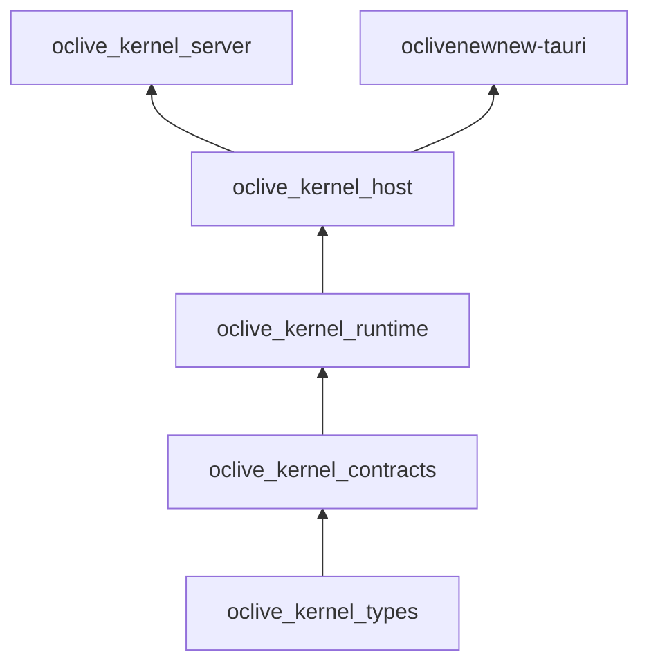

# Workspace crates 速查

Rust 贡献者与 Agent：各 kernel crate 职责、依赖方向、改 X 去哪。

**Schema 例外**：槽位/蓝图校验类型以 `oclive_validation` 为磁盘 SSOT；`oclive_kernel_types` 的 re-export 仅为 ergonomic。见 [NAMING_CONVENTIONS.md §3.1](../../creator-docs/NAMING_CONVENTIONS.md#31-schema-类型例外oclive_validation-vs-oclive_kernel_types)。

## 依赖方向

## Crate 速查表

| Crate | 职责 | Workspace | 典型改法 |
|-------|------|-----------|----------|
| `oclive_kernel_types` | DTO、`AppError`、`SendMessageRequest/Response` | 是 | 改 API 契约字段 |
| `oclive_sqlx` | SQLite-only SQLx facade（供应链守门；禁 `sqlx` 元 crate） | 是 | 见 [oclive_sqlx/README.md](oclive_sqlx/README.md) |
| `oclive_kernel_contracts` | trait 端口（`LlmClient`、`MemoryRepository`…） | 是 | 新增可替换后端接口 |
| `oclive_kernel_runtime` | 纯引擎（`PromptBuilder`、各 `*_engine`） | 是 | 改业务公式，无 I/O |
| `oclive_kernel_host` | 编排 + DB + HTTP + `process_message` | 是 | 改回合流程、持久化 |
| `oclive_kernel_server` | 无头二进制 `oclive-kernel-server --api` | 是 | 仅 CLI/发行版入口 |
| `oclive_validation` / `_wasm` | 角色包/蓝图校验 | 是 | 改 manifest 规则 |
| `oclive_schema` | 纯 serde schema（blueprint） | 是 | 磁盘形状增量迁移 |
| `oclive-cli` | 脚手架 init/build/bench | 是 | 模板与 CLI 命令 |
| `distros/desktop-tauri` | 桌面 IPC 薄壳、`kernel_attach` | 是 | Tauri 命令、attach/spawn |

> 历史：实验 scheduler 代理 `oclive_runtimed` 已于 2026-06-10 删除（D-ORPHAN-01）；恢复见 `git log --diff-filter=D -- crates/oclive_runtimed`。

## Canonical import 路径

命名 SSOT 与禁止别名见 **[creator-docs/NAMING_CONVENTIONS.md §4.2](../../creator-docs/NAMING_CONVENTIONS.md#42-canonical-import-路径)**。

- **DTO / 错误**：`oclive_kernel_types::…`（host 内可用 `crate::models::`）
- **Trait 端口**：`oclive_kernel_contracts::…`（host 经 `domain::ports` re-export）
- **编排与引擎**：在 **`oclive_kernel_host` 内**用 `crate::domain::…`；**不要**在 host 外直接依赖 runtime 编排细节

## 常见任务 → 文件

- 单条消息流程 → `oclive_kernel_host/.../process_message.rs`
- Prompt 段落 → `oclive_kernel_runtime/.../prompt_builder/mod.rs`（段落公式 `sections.rs`）
- Tauri 命令 → `../../distros/desktop-tauri/src/api/*.rs` + `lib.rs` 注册
- 角色包校验 → `oclive_validation`
- 分层纪律 → [handoff/ARCHITECTURE_LAYERING.md](../../handoff/ARCHITECTURE_LAYERING.md) + [oclive_kernel_host/src/domain/README.md](oclive_kernel_host/src/domain/README.md)

## 延伸阅读

- [handoff/ARCHITECTURE_LAYERING.md](../../handoff/ARCHITECTURE_LAYERING.md)
- [handoff/BUS_FACTOR_NOTES.md](../../handoff/BUS_FACTOR_NOTES.md)
- [creator-docs/getting-started/DOCUMENTATION_INDEX.md](../../creator-docs/getting-started/DOCUMENTATION_INDEX.md)
